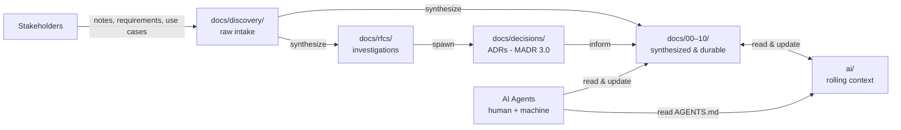
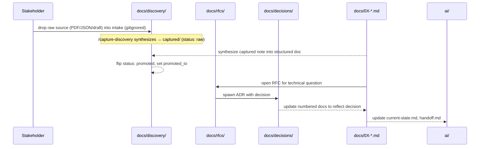

# Architecture

The kit's architecture is conceptual — there is no runtime, no service, no deployment. What this document captures is **how the artifact types relate** and **how information flows** between them.

## Context diagram

## Components

### `docs/discovery/`

**Responsibility:** Raw intake of stakeholder material, then capture into synthesized markdown. Raw source (PDFs, JSON, drafts) lands in gitignored intake folders; `/capture-discovery` synthesizes it into tracked `captured/` notes. Lightweight conventions only. See ADR-0014.

**Depends on:** nothing structural. Stakeholders write in their own language; the team preserves it.

### `docs/rfcs/`

**Responsibility:** Time-boxed technical investigations with a question and a recommendation. Folder-per-RFC so artifacts can live alongside prose.

**Depends on:** the question being investigated, often drawn from `discovery/` or from open questions in `ai/open-questions.md`.

### `docs/decisions/`

**Responsibility:** Immutable records of material technical decisions in MADR 3.0 format.

**Depends on:** an RFC concluded with a recommendation, or a decision made in-line that's substantive enough to capture.

### `docs/00–10/<numbered>.md`

**Responsibility:** The synthesized, durable "answer" layer. Required-doc set varies by profile.

**Depends on:** earlier ADRs, RFCs, and discovery items as inputs. These are where the team's mental model lives in its most consumable form.

### `ai/`

**Responsibility:** Rolling session-to-session context: current state, next actions, open questions, and the most recent handoff.

**Depends on:** the numbered docs (as the durable backdrop) plus whatever the last session changed.

### `AGENTS.md` (root)

**Responsibility:** Single source of truth for the agent contract — canonical reading order and end-of-session contract. Tool-specific pointers (`CLAUDE.md`, `.github/copilot-instructions.md`) reference it.

## Data flow

For a typical change cycle in a downstream repo:

## Trust boundaries

- **Stakeholder content** (in `discovery/`) is *captured*, not *trusted as-is*. Synthesis into numbered docs is the act of reconciliation with engineering reality.
- **`AGENTS.md` is the agent boundary.** Anything an AI agent should do or not do is declared there, not in scattered tool-specific files.
- **ADRs once `Accepted` are inviolable.** Reversal is a new ADR, never an edit.

## Constraints

- Markdown only **in version control**. Raw stakeholder source (PDFs, JSON, decks) is captured locally in the gitignored `docs/discovery/{meetings,requirements,use-cases,notes}/` intake folders and synthesized to markdown; only the markdown (`captured/` notes and the numbered corpus) is committed. See ADR-0014.
- Filename conventions stable across the kit (`NNNN-kebab-case-title.md` for ADRs/RFCs, `YYYY-MM-DD-source-topic.md` for discovery).
- ISO 8601 dates everywhere.
- The kit ships **content**, not tooling. Tooling is queued for Slices 2 and 4.

## Trade-offs

- **Markdown only** (vs. structured-doc formats) — accepts that some queries against the corpus are harder; gains universal toolability. See ADR [0002](./decisions/0002-adopt-madr-3.md).
- **`ai/` committed** (vs. gitignored) — accepts PR diff noise; gains shared institutional memory. See ADR [0004](./decisions/0004-define-ai-directory-contract.md).
- **Separate `discovery/` and `rfcs/`** (vs. a single folder) — accepts an extra top-level folder; gains clean separation of *received* vs. *produced* material. See ADR [0005](./decisions/0005-split-discovery-and-rfcs.md).
- **Gitignore raw discovery intake, track only synthesized `captured/` markdown** (vs. committing source binaries) — accepts that raw originals aren't version-controlled; preserves markdown-only-in-VCS while still accepting PDFs/JSON as input. See ADR [0014](./decisions/0014-capture-stage-for-discovery-gitignore-raw-intake-track-synthesized-markdown.md).
- **`AGENTS.md` + thin pointers** (vs. full per-tool files) — accepts that each new AI tool needs a pointer file; gains a single source of truth. See ADR [0006](./decisions/0006-adopt-agents-md-pattern.md).
