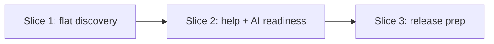

# Implementation Plan

## Roadmap

> Active milestone: **M3 — Workflow simplification & AI readiness** (sliced below)

| Milestone                        | Outcome                                                                                  | Target   | Status  |
|----------------------------------|------------------------------------------------------------------------------------------|----------|---------|
| M1 — Foundation                  | Templates → AI skills → `standards` CLI → CI enforcement → hardening → non-destructive `adopt` | →v0.15.0 | shipped |
| M2 — Roadmap & planning surface  | A standard home for the longitudinal roadmap (this doc + the template `## Roadmap` section) | v0.16.0  | shipped |
| M3 — Workflow simplification & AI readiness | Flat discovery notes, clearer CLI help, local skill scaffolding, and stronger agent-surface checks | v0.17.0 | active |
| M4 — Deeper reporting            | External-link liveness and richer doc-freshness reporting                                 | TBD      | planned |

### Shipped slices (M1 — Foundation)

| Slice | Scope | Status |
|---|---|---|
| 1 | Templates + standards content | Shipped |
| 2 | AI Skills + Hooks (Claude Code, Copilot) | Shipped |
| 3 | Distribution — the `standards` CLI (`init` / `update`), PyPI, 3-class sync | Shipped |
| 4 | Deeper CI enforcement (content/link/placeholder lint, parity + coherence guards) | Shipped |
| 5 | Hardening — `standards check` subcommand + multi-profile CI-green `init` | Shipped |
| 6 | `standards adopt` — non-destructive adoption onto existing repos | Shipped |

### Shipped slices (M2 — Roadmap & planning surface)

| Slice | Scope | Status |
|---|---|---|
| 1 | Roadmap section in the implementation-plan template | Shipped |
| 2 | Dogfood the kit's own roadmap in `docs/05-implementation-plan.md` | Shipped |

## Approach

M3 reduces workflow weight without adding a new product surface: discovery becomes ordinary
tracked markdown again, the CLI help gets clearer, and AI surfaces become easier to scaffold
and verify. Discovery simplification is recorded in
[ADR-0017](./decisions/0017-simplify-discovery-to-tracked-markdown-notes.md); CLI/help and
agent-readiness changes are narrow polish within the existing `standards` and skill contracts.

## Slices

### Slice 1: Simplify discovery back to tracked notes

- **Goal:** remove the capture/promote lifecycle and keep discovery as normal markdown under `docs/discovery/`.
- **Includes:** remove scripts, skills/prompts, SessionStart hooks, intake scaffold, `captured/`, and the `promoted_to` standards check.
- **Excludes:** rewriting historical ADRs/RFCs/changelog entries that describe the old design.
- **Owner:** swanson-dev
- **Verification:** `python scripts/standards-check/check.py`; `python tools/run_tests.py`.

### Slice 2: Polish CLI help and AI readiness

- **Goal:** make common `standards` workflows and local skill surfaces easier to understand and verify.
- **Includes:** richer argparse help, `standards help [command]`, paired skill scaffolding, Copilot pointer checks, and Claude hook script-path checks.
- **Excludes:** new workflow verbs such as `doctor`, `commands`, or `standards new-skill`.
- **Owner:** swanson-dev
- **Verification:** targeted unit tests plus the full release gates.

### Slice 3: Prepare v0.17.0 release state

- **Goal:** make the working tree release-clean after the post-0.16 changes.
- **Includes:** bump version metadata, promote the changelog entry, refresh `ai/` coordination docs, and ignore local `.agents/` / `.codex/` surfaces.
- **Excludes:** publishing to PyPI; the maintainer still pushes the tag and verifies the release workflow.
- **Owner:** codex
- **Verification:** `python tools/run_tests.py`; `python scripts/standards-check/check.py`; `python tools/check_version_coherence.py`.

## Sequencing

## Verification per slice

Release-prep change; verified with the full local gates:
- `python scripts/standards-check/check.py` — links/placeholders/structure.
- `python tools/run_tests.py` — payload/manifest/CLI suite unaffected.
- `python tools/check_version_coherence.py` — version strings stay coherent.

## Open questions blocking the plan

- None. A section-presence lint for the `## Roadmap` block is deferred as YAGNI (RFC-0003).
