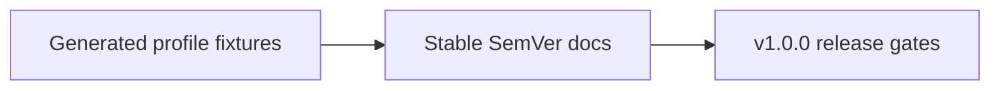

# Implementation Plan

## Roadmap

> Active milestone: **None**. M5 shipped in v1.0.0; choose the next milestone before implementation begins.

| Milestone                        | Outcome                                                                                  | Target   | Status  |
|----------------------------------|------------------------------------------------------------------------------------------|----------|---------|
| M1 — Foundation                  | Templates → AI skills → `standards` CLI → CI enforcement → hardening → non-destructive `adopt` | →v0.15.0 | shipped |
| M2 — Roadmap & planning surface  | A standard home for the longitudinal roadmap (this doc + the template `## Roadmap` section) | v0.16.0  | shipped |
| M3 — Workflow simplification & AI readiness | Flat discovery notes, clearer CLI help, local skill scaffolding, and stronger agent-surface checks | v0.17.0 | shipped |
| M4 — Release and reporting hygiene | GitHub Release consistency, external-link liveness, and richer doc-freshness reporting    | v0.18.0  | shipped |
| M5 — v1.0.0 readiness | Generated four-profile downstream validation, manual external-link workflow, stable SemVer docs | v1.0.0 | shipped |

### Shipped slices (M1 — Foundation)

| Slice | Scope | Status |
|---|---|---|
| 1 | Templates + standards content | Shipped |
| 2 | AI Skills + Hooks (Claude Code, Copilot) | Shipped |
| 3 | Distribution — the `standards` CLI (`init` / `update`), PyPI, 3-class sync | Shipped |
| 4 | Deeper CI enforcement (content/link/placeholder lint, parity + coherence guards) | Shipped |
| 5 | Hardening — `standards check` subcommand + multi-profile CI-green `init` | Shipped |
| 6 | `standards adopt` — non-destructive adoption onto existing repos | Shipped |

### Shipped slices (M2 — Roadmap & planning surface)

| Slice | Scope | Status |
|---|---|---|
| 1 | Roadmap section in the implementation-plan template | Shipped |
| 2 | Dogfood the kit's own roadmap in `docs/05-implementation-plan.md` | Shipped |

## Approach

M5 turns the remaining v1.0.0 release criterion into a reproducible local and CI
gate. Generated downstream fixture repos validate every profile through the
public `standards` adoption path, and release docs now include a
published-package smoke procedure.

M4 closes the quality gaps that appear around releases and long-lived docs: release pages should
exist when changelog links point at them, external links should not silently rot, and `ai/`
freshness should be easier to report on than a simple stale/not-stale warning.

## Slices

### Slice 1: Generated four-profile readiness gate

- **Goal:** prove every profile can be adopted and updated through the public path before v1.0.0.
- **Includes:** `tools/check_v1_readiness.py`, generated downstream fixtures, CI/release workflow gating, and tests.
- **Excludes:** requiring private real-repo adoption as a release blocker.
- **Owner:** codex
- **Status:** Shipped in v1.0.0.
- **Verification:** `python tools/check_v1_readiness.py`; `python tests/test_v1_readiness.py -v`.

### Slice 2: Release polish and stable SemVer docs

- **Goal:** make the v1.0.0 release path and support promise explicit.
- **Includes:** manual external-link workflow, published-package smoke docs, stable SemVer wording, and ADR-0018.
- **Excludes:** new public CLI commands such as `standards new-skill` or `standards doctor`.
- **Owner:** codex
- **Status:** Shipped in v1.0.0.
- **Verification:** workflow contract tests, standards check, version coherence, and build.

### Slice 1: GitHub Release consistency

- **Goal:** make `v0.17.0` and future tag releases visible as GitHub Releases with attached artifacts.
- **Includes:** create the missing `v0.17.0` GitHub Release; update `release.yml` to create/update releases after PyPI publish; update release docs and AI state.
- **Excludes:** backfilling every older missing GitHub Release.
- **Owner:** codex
- **Status:** Shipped.
- **Verification:** `gh release view v0.17.0`; `python scripts/standards-check/check.py`; `python tools/run_tests.py`; `python tools/check_version_coherence.py`.

### Slice 2: External-link liveness

- **Goal:** catch stale external links such as changelog release URLs before they ship.
- **Includes:** an opt-in `--external-links` standards-check mode with conservative defaults and tests.
- **Excludes:** flaky network-hard CI by default; networked checks remain opt-in.
- **Owner:** codex
- **Status:** Shipped in v0.18.0.
- **Verification:** targeted tests with mocked URL results plus standards-check.

### Slice 3: Richer doc-freshness reporting

- **Goal:** make `ai/` drift visible as an actionable report instead of only stale-threshold warnings.
- **Includes:** freshness warnings for `ai/current-state.md`, `ai/next-actions.md`, and `ai/handoff.md`, plus opt-in `--freshness-report` age/status output.
- **Excludes:** turning freshness warnings into hard adopter errors by default.
- **Owner:** swanson-dev
- **Status:** Shipped in v0.18.0.
- **Verification:** standards-check freshness tests plus current repo check.

## Sequencing

## Verification per slice

Release/reporting hygiene work is verified with focused tests and the full local gates:
- `python scripts/standards-check/check.py` — links/placeholders/structure.
- `python tools/run_tests.py` — payload/manifest/CLI suite unaffected.
- `python tools/check_v1_readiness.py` — generated downstream profile fixtures.
- `python tools/check_version_coherence.py` — version strings stay coherent.
- `gh release view v1.0.0` — GitHub Release exists with sdist/wheel artifacts.

## Open questions blocking the plan

- None. A section-presence lint for the `## Roadmap` block is deferred as YAGNI (RFC-0003).
