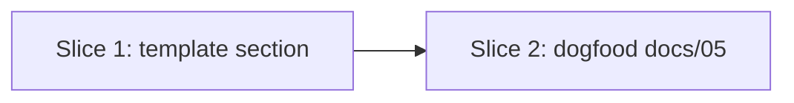

# Implementation Plan

## Roadmap

> Active milestone: **M2 — Roadmap & planning surface** (sliced below)

| Milestone                        | Outcome                                                                                  | Target   | Status  |
|----------------------------------|------------------------------------------------------------------------------------------|----------|---------|
| M1 — Foundation                  | Templates → AI skills → `standards` CLI → CI enforcement → hardening → non-destructive `adopt` | →v0.15.0 | shipped |
| M2 — Roadmap & planning surface  | A standard home for the longitudinal roadmap (this doc + the template `## Roadmap` section) | v0.16.0  | active  |
| M3 — Deeper reporting            | external-link liveness, richer doc-freshness reporting, a `new-skill` scaffolder          | TBD      | planned |

### Shipped slices (M1 — Foundation)

| Slice | Scope | Status |
|---|---|---|
| 1 | Templates + standards content | Shipped |
| 2 | AI Skills + Hooks (Claude Code, Copilot) | Shipped |
| 3 | Distribution — the `standards` CLI (`init` / `update`), PyPI, 3-class sync | Shipped |
| 4 | Deeper CI enforcement (content/link/placeholder lint, parity + coherence guards) | Shipped |
| 5 | Hardening — `standards check` subcommand + multi-profile CI-green `init` | Shipped |
| 6 | `standards adopt` — non-destructive adoption onto existing repos | Shipped |

## Approach

M2 standardizes the roadmap by **extending** the existing implementation-plan template rather
than adding a new artifact — the per-effort slicing/sequencing already lived here; only the
longitudinal milestone horizon was missing. Rationale and the rejected alternatives are in
[ADR-0016](./decisions/0016-add-roadmap-section-to-implementation-plan.md) and
[RFC-0003](./rfcs/0003-how-should-the-kit-standardize-a-milestone-roadmap/rfc.md).

## Slices

### Slice 1: Roadmap section in the template

- **Goal:** the `05-implementation-plan` template carries a `## Roadmap` table + active-milestone scoping.
- **Includes:** the template edit; ships to adopters via the bundled payload.
- **Excludes:** any new `standards-check` rule (section-presence linting deferred — RFC-0003).
- **Owner:** swanson-dev
- **Verification:** `python scripts/standards-check/check.py` green; `python tools/run_tests.py` green.

### Slice 2: Dogfood the kit's own roadmap

- **Goal:** this repo's roadmap lives here, not improvised across README + AGENTS.md.
- **Includes:** this `docs/05-implementation-plan.md`; README roadmap condensed to a pointer; AGENTS.md queued-slices prose pointed here.
- **Excludes:** any change to the bundled payload set (this doc is repo-owned, not shipped).
- **Owner:** swanson-dev
- **Verification:** `python scripts/standards-check/check.py` green (all links resolve).

## Sequencing

## Verification per slice

Markdown-only change; verified structurally rather than by unit tests:
- `python scripts/standards-check/check.py` — links/placeholders/structure.
- `python tools/run_tests.py` — payload/manifest/CLI suite unaffected.
- `python tools/check_version_coherence.py` — version strings stay coherent.

## Open questions blocking the plan

- None. A section-presence lint for the `## Roadmap` block is deferred as YAGNI (RFC-0003).
