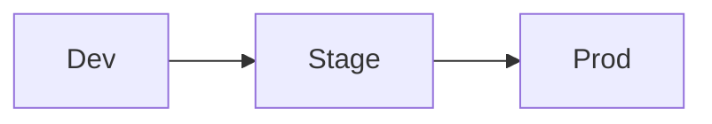

<!--
docs/environments.md — infra-profile extra.
Describes the topology of each environment and the rules for changing it.
-->

# Environments

## Topology

| Environment | Purpose | Account / subscription | Region(s) | Owner |
|---|---|---|---|---|

## Promotion path

- **Dev → Stage:** <how, by whom, what gates>
- **Stage → Prod:** <how, by whom, what gates>

## Change windows

| Environment | Allowed change windows | Required notice | Approver |
|---|---|---|---|

## Drift policy

- **Detection:** <plan / scan cadence, tool>
- **Allowed manual changes:** <emergency-only? never?>
- **Reconciliation cadence:** <how often drift is reviewed and resolved>

## Disaster recovery posture

- **RTO / RPO targets per environment:** <…>
- **Last DR test:** YYYY-MM-DD
