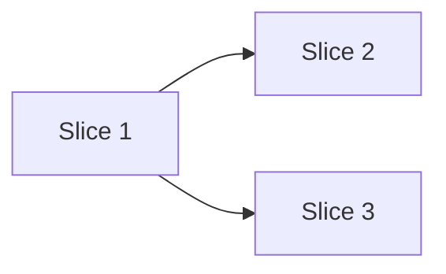

<!--
docs/05-implementation-plan.md — Expected (application, infra, data), Optional (library)
The bridge between PRD/architecture and execution. Slice the work, sequence it, own it.
-->

# Implementation Plan

## Approach

<!-- One paragraph on the overall strategy. Why this approach over alternatives (link RFC if applicable). -->

## Slices

<!-- Vertical slices of value. Each should be independently mergeable and verifiable. -->

### Slice 1: <name>

- **Goal:** <one sentence>
- **Includes:** <list>
- **Excludes:** <list — deliberate non-goals for this slice>
- **Owner:** <name>
- **Verification:** <how we'll know it's done>

### Slice 2: <name>

…

## Sequencing

<!-- Dependencies between slices. What blocks what. Critical path. -->

## Verification per slice

<!-- Tests, walkthroughs, demos. Link to docs/07-testing.md for the broader test strategy. -->

## Open questions blocking the plan

- <link to ai/open-questions.md#q-N>
