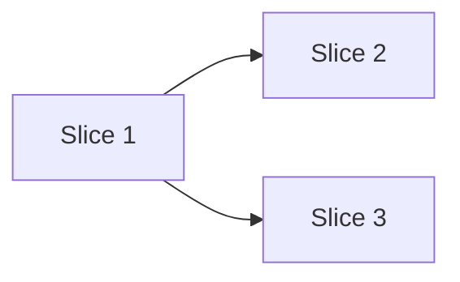

<!--
docs/05-implementation-plan.md — Expected (application, infra, data, documentation), Optional (library)
The bridge between PRD/architecture and execution. Slice the work, sequence it, own it.
-->

# Implementation Plan

## Roadmap

<!--
The longitudinal view: milestones / releases over time. Slow-changing — this is the strategic
frame, not the working surface. Status vocabulary: planned | active | shipped | dropped.
INVARIANT: exactly one milestone is `active` at a time; the ## Slices section below is the
breakdown of that one active milestone. A `dropped` milestone keeps a one-line reason.
-->

> Active milestone: **<M2 — short name>** (sliced below)

| Milestone         | Outcome                        | Target | Status  |
|-------------------|--------------------------------|--------|---------|
| M1 — <short name> | <the outcome it delivered>     | <v0.1> | shipped |
| M2 — <short name> | <the outcome being built now>  | <v0.3> | active  |
| M3 — <short name> | <the next outcome>             | <v0.5> | planned |

## Approach

<!-- One paragraph on the overall strategy for the active milestone. Why this approach over alternatives (link RFC if applicable). -->

## Slices

<!-- Vertical slices of value within the active milestone. Each should be independently mergeable and verifiable. -->

### Slice 1: <name>

- **Goal:** <one sentence>
- **Includes:** <list>
- **Excludes:** <list — deliberate non-goals for this slice>
- **Owner:** <name>
- **Verification:** <how we'll know it's done>

### Slice 2: <name>

…

## Sequencing

<!-- Dependencies between slices. What blocks what. Critical path. -->

## Verification per slice

<!-- Tests, walkthroughs, demos. Link to docs/07-testing.md for the broader test strategy. -->

## Open questions blocking the plan

- <link to ai/open-questions.md#q-N>
